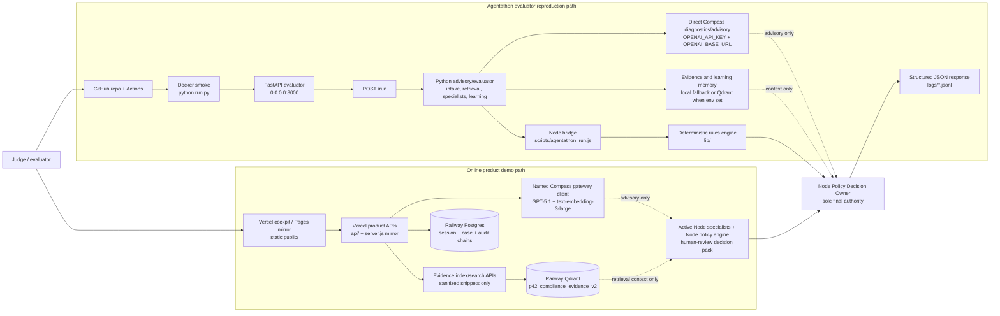

# Agentathon System Architecture

This document is the judge-facing architecture view for the G42 Agentathon submission. It explains how the repository satisfies the evaluator API shape while preserving the existing Parallax42 product runtime.

> **Verified remediation release, 2026-07-12:** implementation SHA `457c7c2` passed 276 Node tests and 13 Python security tests. GitHub Actions CI, Agentathon Preflight (including Docker smoke), and GitHub Pages deployment are green, and the authenticated production workflow was verified at <https://parallax42-agent-v2.vercel.app>. The product uses the named Parallax42 Compass gateway client with GPT-5.1 plus `text-embedding-3-large`, isolated Railway Postgres, and Railway Qdrant. Actor-scoped PostgreSQL audit chains are durable and application-append-only, and Node is the sole policy authority across Python. Demo RBAC is enforced but Entra is absent; immutable/WORM audit storage is not implemented and `enterpriseReady` is not claimed. See the [deep code review](DEEP_CODE_REVIEW.md) and [Azure migration plan](AZURE_MIGRATION_PLAN.md).

## 1. Architectural Position

Parallax42 has two intentionally separate execution surfaces:

| Surface | Primary files | Purpose | Current claim |
| --- | --- | --- | --- |
| Agentathon evaluator path | `run.py`, `app/`, `scripts/agentathon_run.js`, `metadata.json`, `input_examples/`, `output_examples/`, `logs/` | Reproducible API for technical screening on port 8000. | Submission API, multi-agent trace, deterministic final decision, Docker/CI smoke. |
| Product demo path | `server.js`, `api/`, `lib/`, `public/` | Existing Node/CommonJS Vercel/static product experience. | Browser cockpit, smart intake, evidence workflow, review pack UI, product-hosted integrations. |

The FastAPI wrapper is not a rewrite of the product. It is a screening adapter that makes the existing compliance engine and evidence workflow judgeable through a standard `/run` contract.

## 1.1 Final Submission Positioning

The final judge-facing product demo is online-first:

```text
Vercel cockpit (primary) or GitHub Pages mirror
  -> Vercel Node product APIs
  -> isolated Railway Postgres + authenticated Qdrant
  -> named server-side Compass gateway client
  -> GPT-5.1 advisory/smart intake + text-embedding-3-large semantic retrieval
```

The local and Docker paths are reproduction/evaluator paths, not the primary product demo. The root `run.py` path exposes the standardized Agentathon API surface on port `8000`: `GET /health`, `GET /metadata`, role-gated non-disclosing `GET /logs`, `GET /compass/probe`, and `POST /run`.

Current public-hosting status: the product cockpit is hosted on GitHub Pages and its Node/CommonJS APIs are hosted on Vercel. At implementation SHA `457c7c2`, CI, Agentathon Preflight, and Pages are green and an authenticated end-to-end production workflow is verified at <https://parallax42-agent-v2.vercel.app>. Dedicated Railway v2 services provide Postgres and Qdrant, not the FastAPI evaluator. The FastAPI wrapper is implemented in the repository and verified through Docker/GitHub Actions; v2 does not claim the legacy public evaluator as a deployment from this clone.

The browser never receives database keys, Qdrant keys, Compass keys, service tokens, or raw embeddings. The hosted product uses the named gateway client for GPT-5.1 smart intake/advisory calls and `text-embedding-3-large` semantic embeddings. Labelled deterministic hash embeddings remain a fallback/reproduction mode. The direct `OPENAI_API_KEY` / `OPENAI_BASE_URL` contract is preserved separately for evaluator-style FastAPI execution and strict diagnostics.

The Node policy engine is the sole final authority. Compass responses, governed learning memory, Qdrant retrieval, and optional CrewAI output may inform reviewer questions and controls but cannot rewrite Node decision, risk, gaps, controls, readiness, or approval eligibility. `scripts/check_agentathon_wrapper.py` compares the FastAPI policy fields with direct Node output.

## 2. End-to-End Diagram

GitHub renders the following Mermaid diagram as the visual architecture view:



Key reading: the online product demo and evaluator `/run` path are intentionally separate surfaces. Both use the same governance boundary: hosted AI, retrieval, learning memory, and optional CrewAI are advisory, while Node owns the final decision and human-review boundary.

```text
Online GitHub submission
  -> Agentathon Preflight Docker job / python run.py
  -> FastAPI app on 0.0.0.0:8000
     -> GET /health
     -> GET /metadata
     -> GET /logs
     -> GET /compass/probe
     -> GET /evidence/memory/status
     -> learning memory endpoints
     -> POST /run
        -> Agentathon request schema
        -> Python multi-agent council orchestrator
        -> evidence memory provider
           -> local fallback, or Qdrant when configured and smoke-tested
        -> governed learning memory
           -> local JSONL/sample memory, or Qdrant when configured
        -> optional Compass advisory critic
           -> official OPENAI_* direct path for evaluator mode
        -> Node bridge
           -> scripts/agentathon_run.js
           -> lib/ deterministic compliance engine
        -> Deterministic Decision Owner
        -> JSON response + logs/trace-*.jsonl
```

Product demo flow:

```text
Browser cockpit in public/
  -> Vercel API route or local server.js mirror
  -> server-side Compass gateway client
  -> smart intake / active-question validation
  -> evidence indexing and retrieval boundary
  -> deterministic compliance engine
  -> optional advisory council output
  -> human-review decision pack and trace
```

## 3. Runtime Boundaries

| Boundary | Env / URL | Used by | What it is | What it is not |
| --- | --- | --- | --- | --- |
| Evaluator API contract | `run.py`, Dockerfile, Agentathon Preflight | Local/CI technical screening | Reproducible FastAPI `/health`, `/metadata`, role-gated/non-disclosing `/logs`, `/compass/probe`, and `/run` contract. | Not currently claimed as a public v2 deployment. |
| Agentathon direct Compass | `OPENAI_API_KEY`, `OPENAI_BASE_URL=https://compass.core42.ai/v1` | `app/compass_client.py`, `/compass/probe`, `/run`, `scripts/compass_doctor.py`, optional embeddings | Official Agentathon template base first; runtime also accepts `https://api.core42.ai/v1` when confirmed for the issued key. | Not the browser product gateway or the Railway persistence services. |
| Product Compass gateway | `COMPASS_GATEWAY_BASE_URL`, named client token | Existing Node/Vercel product APIs and `lib/compassGatewayClient.js` | Active server-side product boundary for GPT-5.1 smart intake/advisory work and `text-embedding-3-large` embeddings. | Not proof of the official Agentathon direct Compass endpoint and not a browser credential. |
| Optional product backend | `PARALLAX42_BACKEND_URL`, optional `P42_CREWAI_SERVICE_URL` | Parser/OCR support and optional remote product services | Optional infrastructure for richer hosted workflows. | Not a Compass API and should not be used as `OPENAI_BASE_URL`. |
| Product persistence | Encrypted Vercel `DATABASE_URL`, `QDRANT_URL`, `QDRANT_API_KEY`; `QDRANT_COLLECTION=p42_compliance_evidence_v2` | Case/session/quota lifecycle, audit chains, and evidence/learning memory | Isolated Railway Postgres plus Qdrant; hosted audit is durable, hash-chained, application-append-only, and fails closed without Postgres; retrieval is semantic through `text-embedding-3-large`. | Local/FastAPI providers remain environment-specific; PostgreSQL audit is not immutable/WORM retention or proof of `enterpriseReady`. |
| Local fallback memory | no external service required | CI, local demos, sample mode | Deterministic fallback for evidence and governed learning memory. | Not production-durable RAG. |

The active `.env.example` Compass placeholder is the official Agentathon template `https://compass.core42.ai/v1`. Runtime diagnostics also accept `https://api.core42.ai/v1` as an alternate Core42 public API base when Core42/Agentathon confirms it for the issued key. If either host returns HTML or `405` from OpenAI-compatible paths, treat that as endpoint/key mismatch evidence rather than live Compass proof.

Compass is a model and embeddings runtime, not a regulatory knowledge source. Reference intelligence comes from official/public anchors in `reference_context/reference_memory_manifest.json`, including NIST, EU, OECD, ISO, Singapore, UAE, OFAC, BIS, UN/EU sanctions, CourtListener, SEC EDGAR, procurement/debarment, and HSE/ESG sources. The roadmap adds a governed knowledge connector API for allowlisted live sources and correction history; that is future functionality and does not change the current submission boundary.

Model selection is explicit:

```text
MODEL_FAST / MODEL_NAME = gpt-4.1
MODEL_REASONING / REASONING_MODEL_NAME / CREWAI_LLM_MODEL = gpt-5.1
EMBEDDING_MODEL / EMBEDDINGS_MODEL = text-embedding-3-large
```

The direct evaluator configuration supports `gpt-4.1` for lower-latency structured work, `gpt-5.1` for deeper advisory output, and `text-embedding-3-large` for embeddings. Separately, the hosted product is verified on the named gateway client with GPT-5.1 and `text-embedding-3-large`; deterministic hash vectors are fallback. The evaluator can run with its own rotated operator credential through `OPENAI_API_KEY`.

## 4. Agentathon `/run` Flow

`POST /run` accepts the official evaluator-style payload:

```json
{
  "run_id": "eval-001",
  "use_case_id": "21",
  "input": {
    "query": "...",
    "case": {},
    "evidence": []
  },
  "options": {
    "sample_mode": false,
    "max_iterations": 3
  }
}
```

The response includes the official fields plus backward-compatible details:

```text
run_id
status
use_case_id
output
agents
agent_trace
trace_id
log_file
execution_time_seconds
```

The orchestrator sequence is:

1. Intake Agent extracts case facts and identifies missing facts.
2. Evidence Retrieval Agent indexes/searches evidence through local fallback or Qdrant.
3. Privacy, Security, and Responsible AI specialists validate or challenge the evidence.
4. Learning & Precedent Specialist retrieves advisory similar-case patterns and controls.
5. Compass Advisory Critic attempts live advisory review when non-sample mode and credentials allow it.
6. Node policy supplies the final result; Python copies its policy fields unchanged and records specialist/Compass material as advisory.
7. Audit Packager writes structured output and JSONL trace logs under `logs/`.

The trace is deliberately non-linear. It includes delegation, evidence retry or fallback, critique, validation, escalation, shared context updates, and final synthesis.

Fixture contract intelligence is part of the same flow, not a separate shortcut. If `input.documents[]` references one of the generated PDFs under `test-fixtures/compliance-documents/`, `app/fixture_documents.py` safely resolves the manifest-listed file, extracts generated text streams or falls back to the expected profile metadata, converts that material into evidence, and then passes it through the evidence memory and specialist council. The output adds `fixture_document_analysis` with documents used, detected domain, extraction status, profile match, matched risk domains, and matched missing evidence. The trace records `Evidence Retrieval Agent -> ingest_fixture_document` before retrieval. This supports the synthetic fixture demo only; arbitrary scanned-PDF OCR is not claimed.

The Node product runtime mirrors the fixture manifest through `lib/fixtureDocuments.js` and `/api/fixture-documents/lookup`, so the cockpit can recognize uploaded generated PDFs by filename, mark them as fixture-profile evidence, index citation-safe metadata/text, and update the chat case draft with supplier/provider, service summary, risk domains, and missing evidence signals. Browser state still receives no provider secrets and no raw embeddings.

## 5. Final Decision Authority

The system separates advisory intelligence from approval authority:

| Input source | Can influence required actions? | Can directly approve/reject? | Notes |
| --- | --- | --- | --- |
| Node policy engine | Yes | Sole owner | Owns decision, risk, gaps, controls, readiness, approval eligibility, and human-review boundary. |
| Specialist council findings | Advisory only | Must not | Recorded separately and cannot revise Node-owned policy fields. |
| Compass advisory | Reviewer questions or notes only | Must not | Grounding/source-span hardening remains, but output cannot rewrite the Node result. |
| Governed learning memory | Reviewer questions/context only | Must not | Workspace/project derives from the authenticated actor; resource-wide membership/RLS remains future hardening. |
| CrewAI live runtime | Yes, if enabled and successful | Must not | Optional path; disabled by default and subject to immutable policy parity tests. |

The output records:

```text
decision_authority.final_owner = Deterministic Decision Owner
decision_authority.llm_advisory_only = true
human_review_required = true/false based on deterministic policy
```

## 6. Live AI And Compass Usage

There are two live-AI stories, and they should not be mixed:

1. Agentathon evaluator mode uses `OPENAI_API_KEY` and the official template `OPENAI_BASE_URL=https://compass.core42.ai/v1`; it can also use `https://api.core42.ai/v1` when confirmed for the issued key.
   - `/compass/probe` checks `/models` and `/chat/completions`.
   - `scripts/compass_doctor.py --strict` is the live proof command.
   - `REQUIRE_COMPASS=true` makes non-sample `/run` return a structured error if Compass is unavailable.
   - `MODEL_FAST=gpt-4.1`, `MODEL_REASONING=gpt-5.1`, and `EMBEDDING_MODEL=text-embedding-3-large` follow the documented Compass-compatible model split used by this repo.

2. Product demo mode uses the named Parallax42 server-side gateway client.
   - The browser never receives model keys.
   - The active hosted path uses GPT-5.1 for smart intake/advisory responses and `text-embedding-3-large` for embeddings.
   - This keeps the product aligned with the long-term architecture while the FastAPI wrapper satisfies evaluator shape.

`SAMPLE_MODE=true` is a deterministic fallback for CI and reproducible demos. It is not a live Compass proof and does not load canned output examples.

## 7. Conversation And Clarification Loop

The product chat has an active-question contract:

```text
active question
  -> user answer
  -> field extraction
  -> answer validation
     -> relevant answer: update case and advance
     -> useful but different answer: capture context and keep the active question
     -> unrelated answer: do not pollute case state, repeat the active clarification
     -> unknown/pending: record a known gap and continue when policy allows
```

Example:

```text
Question: From which country or export-control jurisdiction will the supplier ship?
Answer: from the US
Result: exportOriginJurisdiction = US, import geography remains UAE/Singapore, next question advances.
```

This prevents unrelated responses from being treated as compliance facts and keeps the conversation adaptive while still auditable.

After a council run, the chat treats new information as a case amendment rather than an implicit fresh case. The retained state includes uploaded evidence metadata, indexed evidence context, last council run summary, case version, material changes, and pending clarification state. Update behavior is:

```text
clear addition: "also", "as well", "in addition", "include"
  -> append the new geography/scope/data category to the existing case
  -> mark the previous council result as superseded_pending_rerun when material

clear replacement: "replace", "instead", "change to", "only"
  -> replace the prior field
  -> mark the previous council result as superseded_pending_rerun when material

ambiguous post-council update: "Syria" or "external customers"
  -> ask whether the answer should be added or used as a replacement
  -> do not mutate the prior case until the user answers
```

The right rail surfaces this as `Case updated after council` and offers `Rerun council`. Rerun is explicit; ordinary follow-up chat does not silently overwrite the previous decision memo or auto-run a new council result.

Council completion now returns one authoritative completed case snapshot/version, and the browser replaces its draft from that snapshot. Unit and Playwright mock regressions cover council -> follow-up -> second council; repeat the sequence on the deployed authenticated URL during release verification.

## 8. Evidence RAG Memory

Evidence memory supports two providers:

| Provider | When used | Behavior |
| --- | --- | --- |
| `qdrant` | `P42_VECTOR_STORE_PROVIDER=qdrant` and Qdrant env vars are configured | Chunks evidence, uses Compass semantic embeddings in the hosted product (labelled deterministic hash vectors remain fallback), stores `type=evidence_chunk` payloads, searches by `caseId`, and returns citation-safe snippets. |
| `local-fallback` | Default when Qdrant or embeddings are unavailable | Uses lexical retrieval over synthetic/input evidence. Useful for CI and deterministic demos; not durable. |

The browser/API response does not expose raw embedding vectors. Evidence results include safe fields such as snippet, title, document ID, evidence ID, chunk index, domain, and score.

Deployed product proof is online-first. Vercel hosts the primary browser and product APIs; the GitHub Pages mirror calls the same APIs. Those APIs use encrypted server-side Qdrant credentials to index/search the isolated Railway collection. The verified product health and evidence API indicators are:

```text
provider=qdrant
storage=server_side_qdrant_vector_db
collection=p42_compliance_evidence_v2
model=text-embedding-3-large
browserEmbeddingsRetained=false
```

The Railway Qdrant endpoint is expected to reject unauthenticated access. Judges should test Qdrant through the Vercel product API, not by requesting direct credentials.

Smoke command:

```bash
python scripts/qdrant_smoke.py
python scripts/agentathon_preflight.py --qdrant-smoke
```

## 9. Governed Learning Memory

Learning memory is advisory precedent storage, not model training.

Supported artifact types:

```text
case_outcome
reviewer_feedback
control_pattern
decision_override
evidence_quality_note
```

Providers:

| Provider | When used | Behavior |
| --- | --- | --- |
| `qdrant` | Qdrant plus deterministic demo or Compass embeddings are configured | Stores/retrieves learning artifacts as advisory vector memory. |
| `local-jsonl` | Default fallback | Reads synthetic seed data from `data/sample_learning_memory.json` and optional local JSONL feedback. |

Learning memory surfaces similar cases, repeated evidence gaps, and suggested controls without mutating policy. Learning and governance namespaces derive from the authenticated actor and ignore caller-selected workspace/project values.

## 10. Optional CrewAI Runtime

The hosted product uses the Node policy engine plus active Node specialists. Live Python CrewAI is optional and currently inactive:

```text
AGENT_RUNTIME=crewai_live
CREWAI_ENABLE_LIVE_LLM=1
```

Default Docker/CI does not require CrewAI. If live CrewAI is enabled and fails, the wrapper records advisory unavailability and continues through the deterministic path. CrewAI is non-authoritative; the wrapper parity check protects the Node policy-field contract.

## 11. Security And Trust Boundaries

| Boundary | Current behavior |
| --- | --- |
| Secrets | `.env` is ignored; `.env.example` contains placeholders only; preflight scans for obvious committed secrets. |
| Browser keys | Browser never receives Compass, gateway, Qdrant, or embedding provider keys. |
| Embeddings | Raw embedding vectors are not returned to browser/API callers. |
| Documents | Sample/evaluator data is synthetic. Production OCR/parser persistence is not claimed in this repo. |
| Audit | Hosted runtimes use durable actor-derived workspace/project PostgreSQL hash chains; writes are append-only through the application, detailed reads are role-gated/scoped/private, `/api/logs` is removed, and JSONL is local/test-only. This is not immutable/WORM storage; export, restore proof, database policy, and critical business/audit transaction coupling remain open. |
| RBAC | Demo RBAC is enforced. Entra tenant/issuer/audience/app-role/membership and PostgreSQL RLS are not configured. |
| Approval | No autonomous approval. Conditional is nonterminal; only Node `approvalEligible: true` permits a human approval action. |

## 12. File Map

| Area | Files |
| --- | --- |
| FastAPI evaluator API | `run.py`, `app/main.py`, `app/schemas.py` |
| Agentathon orchestrator | `app/agentathon_orchestrator.py`, `app/trace_logger.py` |
| Compass diagnostics | `app/compass_client.py`, `scripts/compass_doctor.py` |
| Node bridge | `app/node_bridge.py`, `scripts/agentathon_run.js` |
| Evidence memory | `app/evidence_memory.py`, `scripts/qdrant_smoke.py`, `lib/evidenceVectorStore.js` |
| Governed learning memory | `app/learning_memory.py`, `data/sample_learning_memory.json`, `lib/learningMemory.js` |
| Optional CrewAI | `app/crewai_runtime.py`, `docs/CREWAI_ARCHITECTURE.md`, `requirements-crewai.txt` |
| Product runtime | `server.js`, `api/`, `lib/`, `public/` |
| Examples and traces | `input_examples/`, `output_examples/`, `logs/` |
| Submission checks | `scripts/agentathon_preflight.py`, `.github/workflows/agentathon-preflight.yml`, `Dockerfile` |

## 13. Verification Flow

The submission is reviewed online first. Local commands are secondary reproduction tools.

Primary online checks:

| Online check | Link | Expected result |
| --- | --- | --- |
| Repository contents | <https://github.com/slackspac3/Parallax42-Agent-v2> | Root evaluator files, examples, logs, docs, Dockerfile, and workflows are visible on `main`. |
| Product cockpit | <https://slackspac3.github.io/Parallax42-Agent-v2/> | Static cockpit loads and reaches the configured hosted product routes. |
| Vercel product API health | <https://parallax42-agent-v2.vercel.app/api/health> | Hosted product runtime reports Compass gateway, Qdrant evidence memory, learning memory, parser relay, and advisory runtime status without exposing secrets. |
| Vercel evidence API | `POST https://parallax42-agent-v2.vercel.app/api/evidence/index`, `POST /api/evidence/search` | Online Qdrant proof path returns `provider=qdrant`, `storage=server_side_qdrant_vector_db`, and sanitized matches. |
| Agentathon Preflight | <https://github.com/slackspac3/Parallax42-Agent-v2/actions/workflows/agentathon-preflight.yml> | `agentathon-preflight` and `docker-smoke` jobs pass. |
| CI | <https://github.com/slackspac3/Parallax42-Agent-v2/actions/workflows/ci.yml> | `npm run qa` passes online. |

Release evidence for implementation SHA `457c7c2`: 276 Node tests and 13 Python security tests passed; CI, Agentathon Preflight, and GitHub Pages are green; and an authenticated create/intake/run/follow-up production workflow completed successfully at <https://parallax42-agent-v2.vercel.app>.

The online `docker-smoke` job is the evaluator reproducibility proof: it builds the image, runs `python run.py` inside the container, calls `GET /health`, and posts `input_examples/example_1.json` to `POST /run`.

Before submitting or recording, verify locally or through CI:

```text
GET  http://127.0.0.1:8000/health
GET  http://127.0.0.1:8000/metadata
GET  http://127.0.0.1:8000/logs  # requires auditor bearer; returns no trace entries
GET  http://127.0.0.1:8000/compass/probe
POST http://127.0.0.1:8000/run
```

Do not use GitHub Pages, Vercel product APIs, or the Railway persistence services as FastAPI proof unless a separate deployment exposes the official Agentathon request/response schema.

Secondary local checks:

```bash
npm run qa
python scripts/agentathon_preflight.py
python scripts/agentathon_preflight.py --run-api
python scripts/agentathon_preflight.py --json
python -m json.tool metadata.json
```

Docker:

```bash
python scripts/agentathon_preflight.py --docker
```

If Docker is not installed locally, this reports `SKIPPED_DOCKER_CLI_MISSING`. GitHub Actions verifies Docker through `.github/workflows/agentathon-preflight.yml`.

Compass:

```bash
export OPENAI_API_KEY=<real Compass key>
export OPENAI_BASE_URL=https://compass.core42.ai/v1
export SAMPLE_MODE=false
export REQUIRE_COMPASS=true
python scripts/compass_doctor.py --strict
curl http://localhost:8000/compass/probe
```

Qdrant:

```bash
export P42_VECTOR_STORE_PROVIDER=qdrant
export QDRANT_URL=<qdrant-url>
export QDRANT_API_KEY=<qdrant-key>
export QDRANT_COLLECTION=p42_compliance_evidence_v2
python scripts/qdrant_smoke.py
```

Artifact regeneration:

```bash
python scripts/regenerate_agentathon_artifacts.py
python scripts/agentathon_preflight.py
```

## 14. Safe And Unsafe Claims

Safe claims when the current checks pass:

- Root `run.py` exposes the Agentathon evaluator API on port 8000.
- `/run`, `/health`, `/metadata`, `/logs`, and `/compass/probe` exist.
- Docker CI smoke verifies image build plus `/health` and `/run` in sample mode.
- Multi-agent traces show delegation, retry/fallback, critique, validation, escalation, and shared context.
- Output examples are generated from runtime examples and are not loaded as canned responses.
- Deployed product evidence indexing/search uses Qdrant through Vercel and the isolated Railway v2 collection.
- The hosted product uses the named Compass gateway client with GPT-5.1 and `text-embedding-3-large` semantic retrieval.
- Railway Postgres durably stores case, session, quota, and scoped hash-chained audit records; the audit API is application-append-only.
- Implementation SHA `457c7c2` has green CI, Agentathon Preflight, and Pages checks plus an authenticated production workflow verification at <https://parallax42-agent-v2.vercel.app>.
- Local/FastAPI Qdrant is env-dependent and falls back when Qdrant or embeddings are unavailable.
- Active hosted specialists are Node-based; live Python CrewAI is optional and inactive.

Unsafe claims unless separately verified:

- The official placeholder Compass host is live-verified in every environment.
- Qdrant is active in every runtime without env-specific verification.
- Entra-backed enterprise RBAC is active.
- Live CrewAI is active.
- PostgreSQL audit is immutable/WORM retained or atomically coupled to every business write.
- Entra/membership/RLS and full resource-wide tenant isolation are implemented.
- A future implementation remains green or production-verified without rerunning the release checks.
- Mentioning or asking about an evidence artifact proves that it was supplied or verified (it does not).
- Product gateway, Vercel, or Railway persistence endpoints are the official Agentathon `OPENAI_BASE_URL`.

## 15. Submission Narrative

The concise architecture narrative is:

```text
Parallax42 preserves the Node/Vercel product and adds a root FastAPI Agentathon wrapper for reproducible screening. The wrapper is independently verified through Docker CI rather than claimed as a public v2 deployment. Implementation SHA `457c7c2` passed 276 Node tests and 13 Python security tests, has green CI/Preflight/Pages checks, and completed an authenticated production workflow at <https://parallax42-agent-v2.vercel.app>. The hosted product uses a named Compass gateway client for GPT-5.1 smart intake/advisory specialists and `text-embedding-3-large` semantic retrieval, Railway Postgres for case/session/quota plus durable scoped hash-chained audit records, and Railway Qdrant for vector memory. The audit API is application-append-only but is not immutable/WORM or `enterpriseReady`. The evaluator delegates policy execution to Node and preserves that policy contract unchanged; Compass, retrieval, learning memory, and optional Python CrewAI are advisory. Human review stays explicit, conditional is nonterminal, and only Node approval eligibility permits approval. Entra/membership/RLS, immutable audit export/restore/business coupling, immutable artifacts, and admission controls remain open.
```
