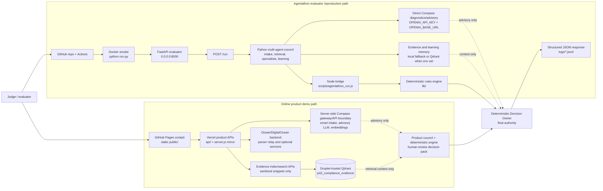

# Agentathon System Architecture

This document is the judge-facing architecture view for the G42 Agentathon submission. It explains how the repository satisfies the evaluator API shape while preserving the existing Parallax42 product runtime.

## 1. Architectural Position

Parallax42 has two intentionally separate execution surfaces:

| Surface | Primary files | Purpose | Current claim |
| --- | --- | --- | --- |
| Agentathon evaluator path | `run.py`, `app/`, `scripts/agentathon_run.js`, `metadata.json`, `input_examples/`, `output_examples/`, `logs/` | Reproducible API for technical screening on port 8000. | Submission API, multi-agent trace, deterministic final decision, Docker/CI smoke. |
| Product demo path | `server.js`, `api/`, `lib/`, `public/` | Existing Node/CommonJS Vercel/static product experience. | Browser cockpit, smart intake, evidence workflow, review pack UI, product-hosted integrations. |

The FastAPI wrapper is not a rewrite of the product. It is a screening adapter that makes the existing compliance engine and evidence workflow judgeable through a standard `/run` contract.

## 1.1 Final Submission Positioning

The final judge-facing product demo is online-first:

```text
GitHub Pages cockpit
  -> Vercel product APIs
  -> server-side Compass gateway/API boundary
  -> Ocean/DigitalOcean backend services
  -> droplet-hosted Qdrant evidence memory
```

The local and Docker paths are reproduction/evaluator paths, not the primary product demo. The root `run.py` path remains important because it exposes the standardized Agentathon API surface on port `8000`: `GET /health`, `GET /metadata`, `GET /logs`, `GET /compass/probe`, and `POST /run`.

Current public-hosting status: the FastAPI evaluator wrapper is implemented in the repository and verified through Docker/GitHub Actions, but it is not the public GitHub Pages or Vercel product URL. GitHub Pages is static, Vercel serves the Node/CommonJS product APIs, and the product backend/droplet routes are not the Agentathon `run.py` API unless separately redeployed from this repo Dockerfile. This avoids misleading judges: the online product demo proves product behavior; the CI Docker smoke proves the required FastAPI evaluator behavior.

Compass is used server-side. The browser never receives Compass keys, Qdrant keys, service tokens, or raw embeddings. The deployed product path uses Compass-backed smart intake/advisory calls and Compass-compatible embeddings through hosted server-side routes. The direct `OPENAI_API_KEY` / `OPENAI_BASE_URL` contract is preserved for evaluator-style FastAPI execution and strict diagnostics.

The Deterministic Decision Owner remains final authority. Compass responses, governed learning memory, Qdrant retrieval, and optional CrewAI output can inform reviewer questions and controls, but they cannot autonomously approve, reject, or silently mutate policy.

## 2. End-to-End Diagram

GitHub renders the following Mermaid diagram as the visual architecture view:



Key reading: the online product demo and the evaluator `/run` path are intentionally separate surfaces. Both preserve the same governance boundary: hosted AI, Qdrant retrieval, learning memory, and optional CrewAI are advisory; deterministic policy owns the final decision and human-review boundary.

```text
Online GitHub submission
  -> Dockerfile / python run.py
  -> FastAPI app on 0.0.0.0:8000
     -> GET /health
     -> GET /metadata
     -> GET /logs
     -> GET /compass/probe
     -> GET /evidence/memory/status
     -> learning memory endpoints
     -> POST /run
        -> Agentathon request schema
        -> Python multi-agent council orchestrator
        -> evidence memory provider
           -> local fallback, or Qdrant when configured and smoke-tested
        -> governed learning memory
           -> local JSONL/sample memory, or Qdrant when configured
        -> optional Compass advisory critic
           -> official OPENAI_* direct path for evaluator mode
        -> Node bridge
           -> scripts/agentathon_run.js
           -> lib/ deterministic compliance engine
        -> Deterministic Decision Owner
        -> JSON response + logs/trace-*.jsonl
```

Product demo flow:

```text
Browser cockpit in public/
  -> Vercel API route or local server.js mirror
  -> server-side Compass gateway client
  -> smart intake / active-question validation
  -> evidence indexing and retrieval boundary
  -> deterministic compliance engine
  -> optional advisory council output
  -> human-review decision pack and trace
```

## 3. Runtime Boundaries

| Boundary | Env / URL | Used by | What it is | What it is not |
| --- | --- | --- | --- | --- |
| Agentathon direct Compass | `OPENAI_API_KEY`, `OPENAI_BASE_URL=https://compass.core42.ai/v1` | `app/compass_client.py`, `/compass/probe`, `/run`, `scripts/compass_doctor.py`, optional embeddings | Official Agentathon template base first; runtime also accepts `https://api.core42.ai/v1` when confirmed for the issued key. | Not the browser product gateway and not the droplet backend. |
| Product Compass gateway | `COMPASS_GATEWAY_BASE_URL`, `COMPASS_GATEWAY_TOKEN` | Existing Node/Vercel product APIs and `lib/compassGatewayClient.js` | Server-side product model boundary for smart intake, advisory LLM, and embeddings. | Not automatically proof of the official Agentathon direct Compass endpoint unless it exposes compatible `/v1` routes and is allowed by rules. |
| Product backend / droplet | `PARALLAX42_BACKEND_URL`, optional `P42_CREWAI_SERVICE_URL` | Backend relay, parser/OCR support, optional remote product services | Product infrastructure for the richer hosted demo. | Not a Compass API and should not be used as `OPENAI_BASE_URL`. |
| Qdrant | Deployed product: encrypted Vercel `P42_VECTOR_STORE_PROVIDER=qdrant`, `QDRANT_URL`, `QDRANT_API_KEY`, `QDRANT_COLLECTION`. Local/FastAPI: same env vars when exported. | Evidence memory and optional learning memory | Active in the deployed Vercel product evidence API through the droplet-hosted Qdrant collection `p42_compliance_evidence`; env-dependent for local/FastAPI runs. | Not active in every runtime by default and not claimed for local/FastAPI unless `qdrant_smoke.py` or equivalent env-specific smoke passes. |
| Local fallback memory | no external service required | CI, local demos, sample mode | Deterministic fallback for evidence and governed learning memory. | Not production-durable RAG. |

The active `.env.example` Compass placeholder is the official Agentathon template `https://compass.core42.ai/v1`. Runtime diagnostics also accept `https://api.core42.ai/v1` as an alternate Core42 public API base when Core42/Agentathon confirms it for the issued key. If either host returns HTML or `405` from OpenAI-compatible paths, treat that as endpoint/key mismatch evidence rather than live Compass proof.

Compass is a model and embeddings runtime, not a regulatory knowledge source. Reference intelligence comes from official/public anchors in `reference_context/reference_memory_manifest.json`, including NIST, EU, OECD, ISO, Singapore, UAE, OFAC, BIS, UN/EU sanctions, CourtListener, SEC EDGAR, procurement/debarment, and HSE/ESG sources. The roadmap adds a governed knowledge connector API for allowlisted live sources and correction history; that is future functionality and does not change the current submission boundary.

Model selection is explicit:

```text
MODEL_FAST / MODEL_NAME = gpt-4.1
MODEL_REASONING / REASONING_MODEL_NAME / CREWAI_LLM_MODEL = gpt-5.1
EMBEDDING_MODEL / EMBEDDINGS_MODEL = text-embedding-3-large
```

`gpt-4.1` is used for lower-latency structured intake and JSON advisory work. `gpt-5.1` is used for deeper specialist/council reasoning and live CrewAI advisory output. `text-embedding-3-large` is used for server-side evidence/reference/learning memory embeddings. The deployed online demo uses the project owner's Compass credentials stored server-side, not a committed key and not an assumed Agentathon-issued key. The same code can run with evaluator-provided credentials by setting `OPENAI_API_KEY`.

## 4. Agentathon `/run` Flow

`POST /run` accepts the official evaluator-style payload:

```json
{
  "run_id": "eval-001",
  "use_case_id": "21",
  "input": {
    "query": "...",
    "case": {},
    "evidence": []
  },
  "options": {
    "sample_mode": false,
    "max_iterations": 3
  }
}
```

The response includes the official fields plus backward-compatible details:

```text
run_id
status
use_case_id
output
agents
agent_trace
trace_id
log_file
execution_time_seconds
```

The orchestrator sequence is:

1. Intake Agent extracts case facts and identifies missing facts.
2. Evidence Retrieval Agent indexes/searches evidence through local fallback or Qdrant.
3. Privacy, Security, and Responsible AI specialists validate or challenge the evidence.
4. Learning & Precedent Specialist retrieves advisory similar-case patterns and controls.
5. Compass Advisory Critic attempts live advisory review when non-sample mode and credentials allow it.
6. Deterministic Decision Owner applies deterministic policy and remains final authority.
7. Audit Packager writes structured output and JSONL trace logs under `logs/`.

The trace is deliberately non-linear. It includes delegation, evidence retry or fallback, critique, validation, escalation, shared context updates, and final synthesis.

Fixture contract intelligence is part of the same flow, not a separate shortcut. If `input.documents[]` references one of the generated PDFs under `test-fixtures/compliance-documents/`, `app/fixture_documents.py` safely resolves the manifest-listed file, extracts generated text streams or falls back to the expected profile metadata, converts that material into evidence, and then passes it through the evidence memory and specialist council. The output adds `fixture_document_analysis` with documents used, detected domain, extraction status, profile match, matched risk domains, and matched missing evidence. The trace records `Evidence Retrieval Agent -> ingest_fixture_document` before retrieval. This supports the synthetic fixture demo only; arbitrary scanned-PDF OCR is not claimed.

The Node product runtime mirrors the fixture manifest through `lib/fixtureDocuments.js` and `/api/fixture-documents/lookup`, so the cockpit can recognize uploaded generated PDFs by filename, mark them as fixture-profile evidence, index citation-safe metadata/text, and update the chat case draft with supplier/provider, service summary, risk domains, and missing evidence signals. Browser state still receives no provider secrets and no raw embeddings.

## 5. Final Decision Authority

The system separates advisory intelligence from approval authority:

| Input source | Can influence required actions? | Can directly approve/reject? | Notes |
| --- | --- | --- | --- |
| Deterministic rules engine | Yes | Yes | Final owner for decision, risk level, required actions, and human-review boundary. |
| Specialist council findings | Yes | No | Converted into controls only through deterministic policy. |
| Compass advisory | Yes, as reviewer questions or notes | No | Advisory only. Failures are structured as unavailable. |
| Governed learning memory | Yes, when current gaps support it | No | Similar cases and control suggestions are advisory only. |
| CrewAI live runtime | Yes, if enabled and successful | No | Optional path; disabled by default and not required for Docker/CI. |

The output records:

```text
decision_authority.final_owner = Deterministic Decision Owner
decision_authority.llm_advisory_only = true
human_review_required = true/false based on deterministic policy
```

## 6. Live AI And Compass Usage

There are two live-AI stories, and they should not be mixed:

1. Agentathon evaluator mode uses `OPENAI_API_KEY` and the official template `OPENAI_BASE_URL=https://compass.core42.ai/v1`; it can also use `https://api.core42.ai/v1` when confirmed for the issued key.
   - `/compass/probe` checks `/models` and `/chat/completions`.
   - `scripts/compass_doctor.py --strict` is the live proof command.
   - `REQUIRE_COMPASS=true` makes non-sample `/run` return a structured error if Compass is unavailable.
   - `MODEL_FAST=gpt-4.1`, `MODEL_REASONING=gpt-5.1`, and `EMBEDDING_MODEL=text-embedding-3-large` follow the documented Compass-compatible model split used by this repo.

2. Product demo mode uses the Parallax42 server-side gateway.
   - The browser never receives model keys.
   - The gateway supports smart intake, advisory LLM responses, and embeddings for product workflows.
   - This keeps the product aligned with the long-term architecture while the FastAPI wrapper satisfies evaluator shape.

`SAMPLE_MODE=true` is a deterministic fallback for CI and reproducible demos. It is not a live Compass proof and does not load canned output examples.

## 7. Conversation And Clarification Loop

The product chat has an active-question contract:

```text
active question
  -> user answer
  -> field extraction
  -> answer validation
     -> relevant answer: update case and advance
     -> useful but different answer: capture context and keep the active question
     -> unrelated answer: do not pollute case state, repeat the active clarification
     -> unknown/pending: record a known gap and continue when policy allows
```

Example:

```text
Question: From which country or export-control jurisdiction will the supplier ship?
Answer: from the US
Result: exportOriginJurisdiction = US, import geography remains UAE/Singapore, next question advances.
```

This prevents unrelated responses from being treated as compliance facts and keeps the conversation adaptive while still auditable.

After a council run, the chat treats new information as a case amendment rather than an implicit fresh case. The retained state includes uploaded evidence metadata, indexed evidence context, last council run summary, case version, material changes, and pending clarification state. Update behavior is:

```text
clear addition: "also", "as well", "in addition", "include"
  -> append the new geography/scope/data category to the existing case
  -> mark the previous council result as superseded_pending_rerun when material

clear replacement: "replace", "instead", "change to", "only"
  -> replace the prior field
  -> mark the previous council result as superseded_pending_rerun when material

ambiguous post-council update: "Syria" or "external customers"
  -> ask whether the answer should be added or used as a replacement
  -> do not mutate the prior case until the user answers
```

The right rail surfaces this as `Case updated after council` and offers `Rerun council`. Rerun is explicit; ordinary follow-up chat does not silently overwrite the previous decision memo or auto-run a new council result.

## 8. Evidence RAG Memory

Evidence memory supports two providers:

| Provider | When used | Behavior |
| --- | --- | --- |
| `qdrant` | `P42_VECTOR_STORE_PROVIDER=qdrant`, Qdrant env vars, and Compass embedding env are configured | Chunks evidence, embeds through Compass/OpenAI-compatible embeddings, stores `type=evidence_chunk` payloads, searches by `caseId`, returns citation-safe snippets. |
| `local-fallback` | Default when Qdrant or embeddings are unavailable | Uses lexical retrieval over synthetic/input evidence. Useful for CI and deterministic demos; not durable. |

The browser/API response does not expose raw embedding vectors. Evidence results include safe fields such as snippet, title, document ID, evidence ID, chunk index, domain, and score.

Deployed product proof is online-first. The GitHub Pages cockpit calls Vercel product APIs; those APIs use encrypted server-side Qdrant credentials to index/search the droplet-hosted collection. The verified product health and evidence API indicators are:

```text
provider=qdrant
storage=server_side_qdrant_vector_db
collection=p42_compliance_evidence
model=text-embedding-3-large
browserEmbeddingsRetained=false
```

The droplet proxy is `https://api.parallax42.bhavukarora.com/qdrant/`. It is expected to return `401 Unauthorized` without the Qdrant API key. Judges should test Qdrant through the Vercel product API, not by requesting direct credentials.

Smoke command:

```bash
python scripts/qdrant_smoke.py
python scripts/agentathon_preflight.py --qdrant-smoke
```

## 9. Governed Learning Memory

Learning memory is advisory precedent storage, not model training.

Supported artifact types:

```text
case_outcome
reviewer_feedback
control_pattern
decision_override
evidence_quality_note
```

Providers:

| Provider | When used | Behavior |
| --- | --- | --- |
| `qdrant` | Qdrant and Compass embeddings are configured | Stores/retrieves learning artifacts as advisory vector memory. |
| `local-jsonl` | Default fallback | Reads synthetic seed data from `data/sample_learning_memory.json` and optional local JSONL feedback. |

Learning memory can surface similar cases, repeated evidence gaps, and suggested controls. It cannot silently mutate policy or override the Deterministic Decision Owner.

## 10. Optional CrewAI Runtime

The stable default runtime is the custom orchestrator. Live CrewAI is optional:

```text
AGENT_RUNTIME=crewai_live
CREWAI_ENABLE_LIVE_LLM=1
```

Default Docker/CI does not require CrewAI. If live CrewAI is enabled and fails, the wrapper records advisory unavailability and continues through the deterministic path. CrewAI outputs are non-authoritative.

## 11. Security And Trust Boundaries

| Boundary | Current behavior |
| --- | --- |
| Secrets | `.env` is ignored; `.env.example` contains placeholders only; preflight scans for obvious committed secrets. |
| Browser keys | Browser never receives Compass, gateway, Qdrant, or embedding provider keys. |
| Embeddings | Raw embedding vectors are not returned to browser/API callers. |
| Documents | Sample/evaluator data is synthetic. Production OCR/parser persistence is not claimed in this repo. |
| Audit | Logs are JSONL and hash/audit capable, but enterprise-durable audit storage is not claimed unless configured separately. |
| RBAC | Audit-mode identity and route policy support exist; enforced production RBAC is not claimed unless configured and verified. |
| Approval | No autonomous approval. Human review boundary remains explicit. |

## 12. File Map

| Area | Files |
| --- | --- |
| FastAPI evaluator API | `run.py`, `app/main.py`, `app/schemas.py` |
| Agentathon orchestrator | `app/agentathon_orchestrator.py`, `app/trace_logger.py` |
| Compass diagnostics | `app/compass_client.py`, `scripts/compass_doctor.py` |
| Node bridge | `app/node_bridge.py`, `scripts/agentathon_run.js` |
| Evidence memory | `app/evidence_memory.py`, `scripts/qdrant_smoke.py`, `lib/evidenceVectorStore.js` |
| Governed learning memory | `app/learning_memory.py`, `data/sample_learning_memory.json`, `lib/learningMemory.js` |
| Optional CrewAI | `app/crewai_runtime.py`, `docs/CREWAI_ARCHITECTURE.md`, `requirements-crewai.txt` |
| Product runtime | `server.js`, `api/`, `lib/`, `public/` |
| Examples and traces | `input_examples/`, `output_examples/`, `logs/` |
| Submission checks | `scripts/agentathon_preflight.py`, `.github/workflows/agentathon-preflight.yml`, `Dockerfile` |

## 13. Verification Flow

The submission is reviewed online first. Local commands are secondary reproduction tools.

Primary online checks:

| Online check | Link | Expected result |
| --- | --- | --- |
| Repository contents | <https://github.com/slackspac3/Parallax42-Agentathon-Online-Clone> | Root evaluator files, examples, logs, docs, Dockerfile, and workflows are visible on `main`. |
| Product cockpit | <https://slackspac3.github.io/Parallax42-Agentathon-Online-Clone/> | Static cockpit loads and reaches the configured hosted product routes. |
| Vercel product API health | <https://parallax42-compliance-intelligence.vercel.app/api/health> | Hosted product runtime reports Compass gateway, Qdrant evidence memory, learning memory, parser relay, and advisory runtime status without exposing secrets. |
| Vercel evidence API | `POST https://parallax42-compliance-intelligence.vercel.app/api/evidence/index`, `POST /api/evidence/search` | Online Qdrant proof path returns `provider=qdrant`, `storage=server_side_qdrant_vector_db`, and sanitized matches. |
| Agentathon Preflight | <https://github.com/slackspac3/Parallax42-Agentathon-Online-Clone/actions/workflows/agentathon-preflight.yml> | `agentathon-preflight` and `docker-smoke` jobs pass. |
| CI | <https://github.com/slackspac3/Parallax42-Agentathon-Online-Clone/actions/workflows/ci.yml> | `npm run qa` passes online. |

The online `docker-smoke` job is the primary evaluator API proof. It builds the image, runs `python run.py` inside the container, calls `GET /health`, and posts `input_examples/example_1.json` to `POST /run`.

If a public FastAPI URL is required by the final submission form, the safe deployment is to run this repo's existing Dockerfile on Railway, Azure Container Apps, App Service for Containers, or another container host and then verify:

```text
GET  /health
GET  /metadata
GET  /logs
GET  /compass/probe
POST /run
```

Do not use a product backend URL as FastAPI proof unless those endpoints and the official Agentathon request/response schema are present.

Secondary local checks:

```bash
npm run qa
python scripts/agentathon_preflight.py
python scripts/agentathon_preflight.py --run-api
python scripts/agentathon_preflight.py --json
python -m json.tool metadata.json
```

Docker:

```bash
python scripts/agentathon_preflight.py --docker
```

If Docker is not installed locally, this reports `SKIPPED_DOCKER_CLI_MISSING`. GitHub Actions verifies Docker through `.github/workflows/agentathon-preflight.yml`.

Compass:

```bash
export OPENAI_API_KEY=<real Compass key>
export OPENAI_BASE_URL=https://compass.core42.ai/v1
export SAMPLE_MODE=false
export REQUIRE_COMPASS=true
python scripts/compass_doctor.py --strict
curl http://localhost:8000/compass/probe
```

Qdrant:

```bash
export P42_VECTOR_STORE_PROVIDER=qdrant
export QDRANT_URL=<qdrant-url>
export QDRANT_API_KEY=<qdrant-key>
export QDRANT_COLLECTION=p42_compliance_evidence
python scripts/qdrant_smoke.py
```

Artifact regeneration:

```bash
python scripts/regenerate_agentathon_artifacts.py
python scripts/agentathon_preflight.py
```

## 14. Safe And Unsafe Claims

Safe claims when the current checks pass:

- Root `run.py` exposes the Agentathon evaluator API on port 8000.
- `/run`, `/health`, `/metadata`, `/logs`, and `/compass/probe` exist.
- Docker CI smoke verifies image build plus `/health` and `/run` in sample mode.
- Multi-agent traces show delegation, retry/fallback, critique, validation, escalation, shared context, and deterministic final ownership.
- Output examples are generated from runtime examples and are not loaded as canned responses.
- Product chat validates active clarifying answers before advancing.
- Product chat retains evidence and prior results after a council run; material follow-up changes are recorded as add/replace case amendments and require rerun before the old result is treated as current.
- Deployed product evidence indexing/search uses Qdrant through Vercel and the droplet-hosted collection.
- Local/FastAPI Qdrant is env-dependent and falls back when Qdrant or embeddings are unavailable.
- Live CrewAI is optional, not default.

Unsafe claims unless separately verified:

- Official direct Compass is live-verified.
- Qdrant is active in every runtime without env-specific verification.
- Compass embeddings are live-verified.
- Live CrewAI is active.
- Enforced production RBAC is active.
- Enterprise-durable audit persistence is implemented.
- Product gateway, Railway, Vercel, or droplet endpoints are the official Agentathon `OPENAI_BASE_URL`.

## 15. Submission Narrative

The concise architecture narrative is:

```text
Parallax42 preserves the existing Node/Vercel product and adds a root FastAPI Agentathon wrapper for reproducible screening. The wrapper exposes the required /run API, runs a multi-agent compliance council, retrieves evidence through local fallback or Qdrant, reads governed learning memory, attempts live Compass advisory in non-sample mode, delegates deterministic execution to the existing Node rules engine, and writes JSONL trace logs. Compass, learning memory, and CrewAI remain advisory; the Deterministic Decision Owner is the final authority and human review remains explicit. The product UI uses a separate server-side gateway for live smart intake and demo workflows, while the evaluator path uses the official OPENAI_* Compass contract.
```
